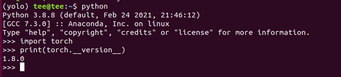

# 2021数字图像处理环境配置（ubuntu）

**说明**：

+ 今年的数字图像处理上机实验基于个人的笔记本电脑完成。该配置教程针对于ubuntu系统。
+ 对于其他的操作系统，可以选择以下几种解决方案：
  + 1）网上查找教程，直接在该系统上配置环境。
  + 2）给笔记本电脑安装双系统。
  + 3）安装虚拟机并安装ubuntu系统。

## 1 Anaconda安装

Anaconda经常在机器学习中使用，Anaconda是一个包含180+的科学包及其依赖项的发行版本。包含的科学包包括：conda, numpy, scipy, ipython notebook等。conda是包及其依赖项和环境的管理工具，适用的语言包括：Python, R, Ruby, Lua, Scala, Java, JavaScript, C/C++, FORTRAN；适用的平台包括：Windows, macOS, Linux。它可以用来快速安装、运行和升级包及其依赖项，以及在计算机中便捷地创建、保存、加载和切换环境。


### 1.1 下载安装包 

两种下载方式可选：

+ 官方网址下载：https://www.anaconda.com/products/individual
+ 清华大学开源镜像站下载：https://mirrors.tuna.tsinghua.edu.cn/anaconda/archive/

选择下载 Anaconda3-5.3.1-Linux-x86_64.sh

### 1.2 安装

转到下载文件的路径下，并且使用命令安装：

```python
bash Anaconda3-5.3.1-Linux-x86_64.sh
```

anaconda会自动将环境变量添加到PATH里面，如果后面你发现输出conda提示没有该命令，那么你需要source \~/.bashrc 这样就是更新环境变量，就可以正常使用了。如果发现这样还是没用，那么需要收到添加环境变量编辑\~/.bashrc 文件，在最后面加上

```python
export PATH=/home/douzp/anaconda3/bin:$PATH
```

保存退出后 source ~/.bashrc 

再次输入conda list测试查看，应该就没有问题了。

在终端中输入python，可以启动Python交互界面，这条命令将会启动Python交互界面，如果Anaconda被成功安装并且可以运行，则将会在Python版本号的右边显示“ |Anaconda, Inc.|”。退出Python交互界面则输入exit()或quit()即可。


Anaconda安装成功后，就可是使用conda来创建新的环境、安装新的包了。

可以使用命令查看目前的虚拟环境

```python
conda info -e
```


如果想要创建新的环境，可以使用以下命令：

```python
conda create --name <env_name>
```

注意：

--name 也可以替换为 -n

<env_name>即创建的环境名。建议以英文命名，且不加空格，名称两边不加尖括号“<>”。
如果要安装指定的版本号，则只需要在包名后面以=和版本号的形式执行。

如：conda create -n test python=3.6 ，即创建一个名为“test ”的环境，环境中安装版本为3.6的python。


如果大家在使用conda 装包的时候很慢或者无比煎熬的时候，可以加入清华镜像源：

```python
conda config --add channels https://mirrors.tuna.tsinghua.edu.cn/anaconda/cloud/pytorch/
conda config --add channels https://mirrors.tuna.tsinghua.edu.cn/anaconda/pkgs/free/
conda config --add channels https://mirrors.tuna.tsinghua.edu.cn/anaconda/pkgs/main/
conda config --set show_channel_urls yes
```


## 2 安装Pytorch


 首先需要激活我们的python环境

```python
conda activate <env_name>
```

注意：使用的环境名称为先前创建的环境名，所以命令为：conda activate test

激活后，应该为:


然后，可以去pytorch官网https://pytorch.org/ ,  查看相应的命令提示：


注意：

+ 我们默认大家使用cpu版本，如果同学具有gpu资源，可以选择对应的CUDA版本。


安装完成后，可以使用以下查看是否成功：


